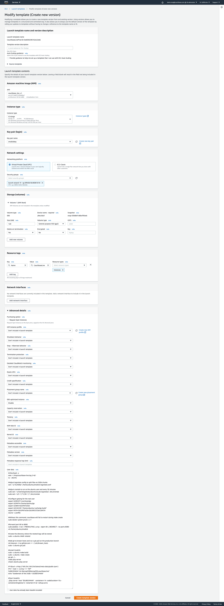

# Couchbase Playground - Production / AWS Environment

The project is deployed on the Developer Advocates (cb-advocates)
account in the N. California region (us-west-1) on AWS.

## How to deploy a new version of Couchbase Playground

After you have merged your changes to the "production" branch of
github.com/couchbaselabs/smallcb, go to
https://us-west-1.console.aws.amazon.com/ec2/v2/home?region=us-west-1#Instances,
select the oldest instance called *CouchbaseLive* and choose "Instance
State" --> "Terminate Instance".

The instance will be terminated and a new replacement will be soon
launched automatically (thanks to an auto scaling group). This new
instance will automatically pull the latest version of the production
branch and should be live and responsive in ~30 minutes.

You can check the state of the init script in the file
"/tmp/couchbase-live.log". Just run the following commands:

```
ssh -i smallcbkey.pem ubuntu@PUBLIC_IP
cat /tmp/couchbase-live.log
```

If you don't have the pem file yet, ask one of the project maintainers.

## TODOS

* Remove Denis's github credentials from the node image
* Automatically kill the nodes after reaching the max lifespan
* Automatically update the cluster once a new update is pushed to the "production" branch on github
* Improve security: limit credentials, close ports, etc.
* Run play-server as ubuntu instead of root.
* Define an automatic scaling strategy for the AutoScaling Group;
* Staging instances.
* Other production variations -- such as for a conference, or for a different use case (N1QL training day).

## VPC

The project has one VPC called
[vpc_smallcb](https://us-west-1.console.aws.amazon.com/vpc/home?region=us-west-1#VpcDetails:VpcId=vpc-086fe1d28c168c0de)
with 2 subnets:

* small-house-subnet: 
    * CIDR: 10.0.1.0/24
    * AZ: us-west-1c
    * Auto-assign public IPv4 address: yes
    
* small-house-subnet2:
    * CIDR: 10.0.2.0/24
    * AZ: us-west-1a
    * Auto-assign public IPv4 address: yes
    
Both subnets are using the Internet Gateway *small_house_gateway*.

## EC2 Config

Currently we are using *t2.xlarge* with 10 containers each, where this
number needs tuning. Cranking up the # of containers may make the
machine unresponsive after a few requests.

The project is using ec2 instances with an auto-scaling group. Each
node is designed to be ephemeral, and should be killed after a few
days to avoid any potential security flaws or abuse.

### Launch Template

The Launch Template is called
[CouchbaseLiveProd](https://us-west-1.console.aws.amazon.com/ec2/v2/home?region=us-west-1#LaunchTemplateDetails:launchTemplateId=lt-0ed030296162e22eb)
or lt-0ed030296162e22eb. Here is the whole template config:



Here are some important highlights of the template above:

* Networking settings: launch-wizard-19
* Storage: 
    * Snapshot *snap-038db91d6bcf95edc* attached to /dev/sda1 with 120GB.
    * The snapshot is called [CouchbaseLiveV1](https://us-west-1.console.aws.amazon.com/ec2/v2/home?region=us-west-1#Snapshots:sort=snapshotId). It is an Ubuntu 18 image with logrotate, docker, go, git (with credentials), aws cli (with credentials) and some default crontabs.
* Resource tags:
    * Name: CouchbaseLive
* User Data: This is the script that is executed once on every new instance to install and run smallcb. Here is the whole script:
```
#!/bin/bash -x
exec > /tmp/couchbase-live.log 2>&1
su - ubuntu

#Adjust logrotate config to split files on 500k chunks
sed -i 's/1k/500k/' /home/ubuntu/smallcb-logrotate.conf 

#Adjust crontab to run as the ubuntu user and every 30 minutes
sudo sed -i 's/root\tlogrotate/ubuntu\tsudo logrotate/' /etc/crontab
sudo sed -i 's/5  \*/*\/30  \*/' /etc/crontab

#Configure golang for the root user
export GOROOT=/usr/local/go
export GOPATH=/home/ubuntu/go
export GOBIN=$GOPATH/bin
export GOCACHE="/home/ubuntu/.cache/go-build"
export PATH=$GOPATH/bin:$GOROOT/bin:$PATH
source ~/.profile

#Without this command, couchbase will fail to restart during make create 
sudo docker system prune -a -f

#Forward port 80 to 8080 
sudo iptables -t nat -I PREROUTING -p tcp --dport 80 -j REDIRECT --to-ports 8080
cd /home/ubuntu/smallcb

#Create the directory where the rotated logs will be stored
sudo -u ubuntu mkdir rotated

#Add git to known hosts and run a git pull on the production branch
ssh-keyscan -t rsa github.com >> ~/.ssh/known_hosts
sudo -u ubuntu git pull

#Install SmallCb
sudo -u ubuntu make build
sudo -u ubuntu make create
go get ./...
make play-server
chown ubuntu play-server

IP=$(curl -s http://169.254.169.254/latest/meta-data/public-ipv4 )
IFS='.' read -r -a array <<< "$IP"
SUBDOMAIN="cb-${array[2]}${array[3]}.couchbase.live"
echo "Subdomain of this node = $SUBDOMAIN"

#Start SmallCb
./play-server -host "$SUBDOMAIN" -containers=10 -sessionsMaxAge=35m0s -codeDuration=60s -containersSingleUse=2 -restarters=5 &> nohup.out &
```

*IMPORTANT:* This script run as "root". For some reason when we tried
to run play-server with the "ubuntu" user, we got some permission
errors. This still is an issue that should be fixed in the future.

### Auto Scaling Groups

The AutoScaling group is called
[couchbase_live](https://us-west-1.console.aws.amazon.com/ec2autoscaling/home?region=us-west-1#/details/couchbase_live?view=details). It
uses the *CouchbaseLiveProd* template and deploy instances on both
*small-house-subnet* and *small-house-subnet2*.

### Load Balancer

The load balancer is called
[CouchbaseLiveLB](https://us-west-1.console.aws.amazon.com/ec2/v2/home?region=us-west-1#LoadBalancers:sort=loadBalancerName).

Here are some important details:

* The SSL certificate is installed on the LB (*.couchbase.live)
* Port 80 on the root domain is forwarded to 443
* SSL is not enforced on the subdomains
* Health checks are made on "NODE_IP/static/test.txt" . This path is configured in the target Group [CouchbaseLiveTargetGroup](https://us-west-1.console.aws.amazon.com/ec2/v2/home?region=us-west-1#TargetGroup:targetGroupArn=arn:aws:elasticloadbalancing:us-west-1:598307997273:targetgroup/CouchbaseLiveTargetGroup/b64dacd393872b94)
 
### Logs

We use [logrotate](https://linux.die.net/man/8/logrotate) to rotate
the logs in each instance. The config is at
"/home/ubuntu/smallcb-logrotate.conf" and it is executed every 30 mins
via crontab.  Here is its content:

```
# see "man logrotate" for details
# rotate log files weekly
weekly

# use the syslog group by default, since this is the owning group
# of /var/log/syslog.
su root syslog

# keep 4 weeks worth of backlogs
rotate 4

# create new (empty) log files after rotating old ones
create

# uncomment this if you want your log files compressed
#compress

# packages drop log rotation information into this directory
#include /etc/logrotate.d

# system-specific logs may be configured here

/home/ubuntu/smallcb/nohup.out {
  size 500k
  missingok
  notifempty
  rotate 5
  sharedscripts
  compress
  copytruncate
  dateext
  dateformat -%Y%m%d-%s
  olddir /home/ubuntu/smallcb/rotated
  lastaction
    echo $@
    INSTANCE_ID="`wget -q -O - http://instance-data/latest/meta-data/instance-id`"
    HOSTNAME=`hostname`
    BUCKET="couchbaselive"
    REGION="us-west-1"
    DAY=$(date '+%d')
    MONTH=$(date '+%m')
    YEAR=$(date '+%Y')
    echo $DAY
    FORMAT=`date "+%Y%m%d"`
    aws s3 sync /home/ubuntu/smallcb/rotated "s3://$BUCKET/${INSTANCE_ID}_${HOSTNAME}/$YEAR/$MONTH/$DAY/" --region $REGION --exclude "*" --include "*.out-$FORMAT*"
  endscript
}
```

Note that we are pushing the logs to a bucket called
[couchbaselive](https://s3.console.aws.amazon.com/s3/buckets/couchbaselive?region=us-west-1&tab=objects)

## Dynamic DNS

Whenever a new instance is deployed inside the *vpc_smallcb* VPC, we
automatically assign a new subdomain to it on Route53. Once the
instance is terminated, we automatically remove the subdomain entry.

### Cloud Watch

The Rule
[CouchbaseLiveWatch](https://us-west-1.console.aws.amazon.com/cloudwatch/home?region=us-west-1#rules:name=CouchbaseLiveWatch)
will listen to events of new nodes being launched or terminated on
*vpc_smallcb*.

Whenever a new event is triggered, the lambda function *cbLiveAddNewNode* is called.

### Lambda Function

The lambda function [cbLiveAddNewNode](https://us-west-1.console.aws.amazon.com/lambda/home#/functions/cbLiveAddNewNode) will be called whenever an instance is launched or terminated on the *vpc_smallcb*. Here is the whole code:
```python
import boto3
import logging
import os

logger = logging.getLogger(name=__name__)
env_level = os.environ.get("LOG_LEVEL")
log_level = logging.INFO if not env_level else env_level
logger.setLevel(log_level)
zone_id = "Z026850834GF57QXIUQ9M"

def lambda_handler(event, context):
    
    instance_id = event["detail"]["EC2InstanceId"]
    if event["detail-type"] == "EC2 Instance Launch Successful":
        logger.info(f"Instance: {instance_id} launched")
        route53_client = boto3.client("route53")
        ec2_client = boto3.client("ec2")
        instance_details = ec2_client.describe_instances(InstanceIds=[instance_id])
        instance_ip = instance_details['Reservations'][0]['Instances'][0]['PublicIpAddress']
        result = instance_ip.split(".")
        host_dns = "cb-"+result[2]+result[3]+".couchbase.live"
        
        ec2_client.create_tags(Resources=[instance_id], Tags=[{'Key':'public_ip', 'Value':instance_ip}])
        ec2_client.create_tags(Resources=[instance_id], Tags=[{'Key':'host_dns', 'Value':host_dns}])

        logger.info(host_dns)
        response = route53_client.change_resource_record_sets(
            HostedZoneId=zone_id,
            ChangeBatch={
                'Comment': 'Dns to ec2 instance',
                'Changes': [
                    {
                        'Action': 'UPSERT',
                        'ResourceRecordSet': {
                            'Name': host_dns,
                            'Type': 'A',
                            'TTL': 300,
                            'ResourceRecords': [
                                {
                                    'Value': instance_ip
                                }
                            ]
                        }
                    }
                ]
            }
        )
        
    if event["detail-type"] == "EC2 Instance Terminate Successful":
        
        ec2_client = boto3.client("ec2")
        instance_details = ec2_client.describe_instances(InstanceIds=[instance_id])
        tags = instance_details['Reservations'][0]['Instances'][0]["Tags"]
        public_ip = ""
        host_dns = ""
        for tag in tags:
            if  tag.get("Key") == "host_dns":
                host_dns = tag.get("Value")
                
            if tag.get("Key") == "public_ip":
                public_ip = tag.get("Value")
                
        route53_client = boto3.client("route53")
        
        response = route53_client.change_resource_record_sets(
            HostedZoneId=zone_id,
            ChangeBatch={
                'Comment': 'Dns to ec2 instance',
                'Changes': [
                    {
                        'Action': 'DELETE',
                        'ResourceRecordSet': {
                            'Name': host_dns,
                            'Type': 'A',
                            'TTL': 300,
                            'ResourceRecords': [
                                {
                                    'Value': public_ip
                                }
                            ]
                        }
                    }
                ]
            }
        )
        
        logger.info("Host deleted from route53")

```

Note that when a new instance is launched, we tag it with the public
ip and the generated subdomain. These two items are need later on to
remove the entry from Route53 when the instance is terminated.
